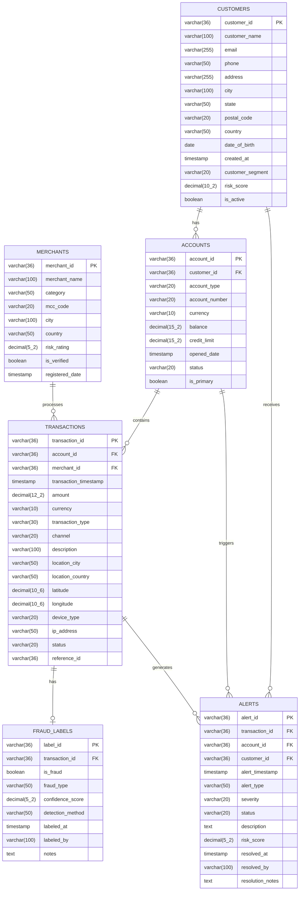

# CoCo-Financial Fraud Analytics - Data Schema

## Overview

CoCo-Financial is a mid-sized financial institution that processes millions of transactions daily. This schema supports their fraud detection and analytics needs.

---

## Entity Relationship Diagram (ERD)



---

## Table Descriptions

### CUSTOMERS

Primary customer information table containing demographic and risk data.

| Column | Type | Description |
|--------|------|-------------|
| customer_id | VARCHAR(36) | Primary key (UUID) |
| customer_name | VARCHAR(100) | Full name |
| email | VARCHAR(255) | Email address |
| phone | VARCHAR(50) | Phone number |
| address | VARCHAR(255) | Street address |
| city | VARCHAR(100) | City |
| state | VARCHAR(50) | State/Province |
| postal_code | VARCHAR(20) | ZIP/Postal code |
| country | VARCHAR(50) | Country |
| date_of_birth | DATE | Date of birth |
| created_at | TIMESTAMP | Account creation date |
| customer_segment | VARCHAR(20) | Segment: Premium, Standard, Basic |
| risk_score | DECIMAL(10,2) | Risk score (0-100) |
| is_active | BOOLEAN | Active status |

### ACCOUNTS

Financial accounts linked to customers.

| Column | Type | Description |
|--------|------|-------------|
| account_id | VARCHAR(36) | Primary key (UUID) |
| customer_id | VARCHAR(36) | Foreign key to CUSTOMERS |
| account_type | VARCHAR(20) | Type: Checking, Savings, Credit, Investment |
| account_number | VARCHAR(20) | Masked account number |
| currency | VARCHAR(10) | Currency code (USD, EUR, etc.) |
| balance | DECIMAL(15,2) | Current balance |
| credit_limit | DECIMAL(15,2) | Credit limit (if applicable) |
| opened_date | TIMESTAMP | Account open date |
| status | VARCHAR(20) | Status: Active, Suspended, Closed |
| is_primary | BOOLEAN | Primary account flag |

### TRANSACTIONS

Individual financial transactions.

| Column | Type | Description |
|--------|------|-------------|
| transaction_id | VARCHAR(36) | Primary key (UUID) |
| account_id | VARCHAR(36) | Foreign key to ACCOUNTS |
| merchant_id | VARCHAR(36) | Foreign key to MERCHANTS |
| transaction_timestamp | TIMESTAMP | Transaction date/time |
| amount | DECIMAL(12,2) | Transaction amount |
| currency | VARCHAR(10) | Currency code |
| transaction_type | VARCHAR(30) | Type: Purchase, Withdrawal, Transfer, Refund, Payment |
| channel | VARCHAR(20) | Channel: Online, POS, ATM, Mobile, Branch |
| description | VARCHAR(100) | Transaction description |
| location_city | VARCHAR(50) | City where transaction occurred |
| location_country | VARCHAR(50) | Country where transaction occurred |
| latitude | DECIMAL(10,6) | GPS latitude |
| longitude | DECIMAL(10,6) | GPS longitude |
| device_type | VARCHAR(20) | Device: Desktop, Mobile, Tablet, ATM, POS |
| ip_address | VARCHAR(50) | IP address (for online transactions) |
| status | VARCHAR(20) | Status: Completed, Pending, Failed, Reversed |
| reference_id | VARCHAR(36) | External reference ID |

### MERCHANTS

Merchant/vendor information.

| Column | Type | Description |
|--------|------|-------------|
| merchant_id | VARCHAR(36) | Primary key (UUID) |
| merchant_name | VARCHAR(100) | Business name |
| category | VARCHAR(50) | Business category |
| mcc_code | VARCHAR(20) | Merchant Category Code |
| city | VARCHAR(100) | City |
| country | VARCHAR(50) | Country |
| risk_rating | DECIMAL(5,2) | Risk rating (1-5) |
| is_verified | BOOLEAN | Verification status |
| registered_date | TIMESTAMP | Registration date |

### FRAUD_LABELS

Fraud classification labels for transactions.

| Column | Type | Description |
|--------|------|-------------|
| label_id | VARCHAR(36) | Primary key (UUID) |
| transaction_id | VARCHAR(36) | Foreign key to TRANSACTIONS |
| is_fraud | BOOLEAN | Fraud indicator |
| fraud_type | VARCHAR(50) | Type: Card_Not_Present, Identity_Theft, Account_Takeover, Friendly_Fraud |
| confidence_score | DECIMAL(5,2) | Model confidence (0-1) |
| detection_method | VARCHAR(50) | Method: ML_Model, Rule_Based, Manual_Review, Customer_Report |
| labeled_at | TIMESTAMP | Label timestamp |
| labeled_by | VARCHAR(100) | Analyst or system |
| notes | TEXT | Additional notes |

### ALERTS

Fraud alerts and their resolution status.

| Column | Type | Description |
|--------|------|-------------|
| alert_id | VARCHAR(36) | Primary key (UUID) |
| transaction_id | VARCHAR(36) | Foreign key to TRANSACTIONS |
| account_id | VARCHAR(36) | Foreign key to ACCOUNTS |
| customer_id | VARCHAR(36) | Foreign key to CUSTOMERS |
| alert_timestamp | TIMESTAMP | Alert creation time |
| alert_type | VARCHAR(50) | Type: Suspicious_Transaction, Velocity_Alert, Geographic_Anomaly, Amount_Anomaly |
| severity | VARCHAR(20) | Severity: Low, Medium, High, Critical |
| status | VARCHAR(20) | Status: Open, Investigating, Resolved, False_Positive |
| description | TEXT | Alert description |
| risk_score | DECIMAL(5,2) | Calculated risk score |
| resolved_at | TIMESTAMP | Resolution timestamp |
| resolved_by | VARCHAR(100) | Resolver name |
| resolution_notes | TEXT | Resolution details |

---

## Views

### VW_TRANSACTION_SUMMARY

Aggregated transaction metrics by customer.

```sql
CREATE OR REPLACE VIEW VW_TRANSACTION_SUMMARY AS
SELECT 
    c.customer_id,
    c.customer_name,
    c.customer_segment,
    c.risk_score as customer_risk_score,
    COUNT(t.transaction_id) as total_transactions,
    SUM(t.amount) as total_amount,
    AVG(t.amount) as avg_transaction_amount,
    COUNT(CASE WHEN f.is_fraud = TRUE THEN 1 END) as fraud_count,
    SUM(CASE WHEN f.is_fraud = TRUE THEN t.amount ELSE 0 END) as fraud_amount,
    ROUND(COUNT(CASE WHEN f.is_fraud = TRUE THEN 1 END) * 100.0 / 
          NULLIF(COUNT(t.transaction_id), 0), 2) as fraud_rate_pct
FROM CUSTOMERS c
LEFT JOIN ACCOUNTS a ON c.customer_id = a.customer_id
LEFT JOIN TRANSACTIONS t ON a.account_id = t.account_id
LEFT JOIN FRAUD_LABELS f ON t.transaction_id = f.transaction_id
GROUP BY c.customer_id, c.customer_name, c.customer_segment, c.risk_score;
```

### VW_FRAUD_METRICS

Daily fraud metrics dashboard.

```sql
CREATE OR REPLACE VIEW VW_FRAUD_METRICS AS
SELECT 
    DATE(t.transaction_timestamp) as transaction_date,
    COUNT(t.transaction_id) as total_transactions,
    SUM(t.amount) as total_amount,
    COUNT(CASE WHEN f.is_fraud = TRUE THEN 1 END) as fraud_transactions,
    SUM(CASE WHEN f.is_fraud = TRUE THEN t.amount ELSE 0 END) as fraud_amount,
    ROUND(COUNT(CASE WHEN f.is_fraud = TRUE THEN 1 END) * 100.0 / 
          NULLIF(COUNT(t.transaction_id), 0), 4) as fraud_rate_pct,
    COUNT(DISTINCT a.alert_id) as alert_count,
    COUNT(CASE WHEN a.severity = 'Critical' THEN 1 END) as critical_alerts
FROM TRANSACTIONS t
LEFT JOIN FRAUD_LABELS f ON t.transaction_id = f.transaction_id
LEFT JOIN ALERTS a ON t.transaction_id = a.transaction_id
GROUP BY DATE(t.transaction_timestamp)
ORDER BY transaction_date DESC;
```

---

## Key Metrics

| Metric | Description | Calculation |
|--------|-------------|-------------|
| Fraud Rate | Percentage of fraudulent transactions | fraud_count / total_transactions * 100 |
| Average Transaction Value | Mean transaction amount | total_amount / total_transactions |
| Alert Resolution Rate | Percentage of resolved alerts | resolved_alerts / total_alerts * 100 |
| High-Risk Customer Ratio | Customers with risk score > 70 | high_risk_customers / total_customers |
| Fraud Detection Accuracy | ML model precision | true_positives / (true_positives + false_positives) |

---

## Data Volume Estimates

For the HOL synthetic dataset:

| Table | Record Count | Notes |
|-------|--------------|-------|
| CUSTOMERS | 1,000 | Diverse segments |
| ACCOUNTS | 1,500 | 1.5 accounts per customer average |
| TRANSACTIONS | 50,000 | ~90 days of data |
| MERCHANTS | 500 | Various categories |
| FRAUD_LABELS | 50,000 | One per transaction |
| ALERTS | 2,500 | ~5% alert rate |

---

## Fraud Patterns Included

The synthetic data includes realistic fraud patterns:

1. **Card-Not-Present (CNP)** - Online transactions without physical card
2. **Velocity Attacks** - Rapid successive transactions
3. **Geographic Anomalies** - Transactions in unusual locations
4. **Amount Anomalies** - Unusually large transactions
5. **Account Takeover** - Changed behavior patterns
6. **Friendly Fraud** - Legitimate customer disputes
